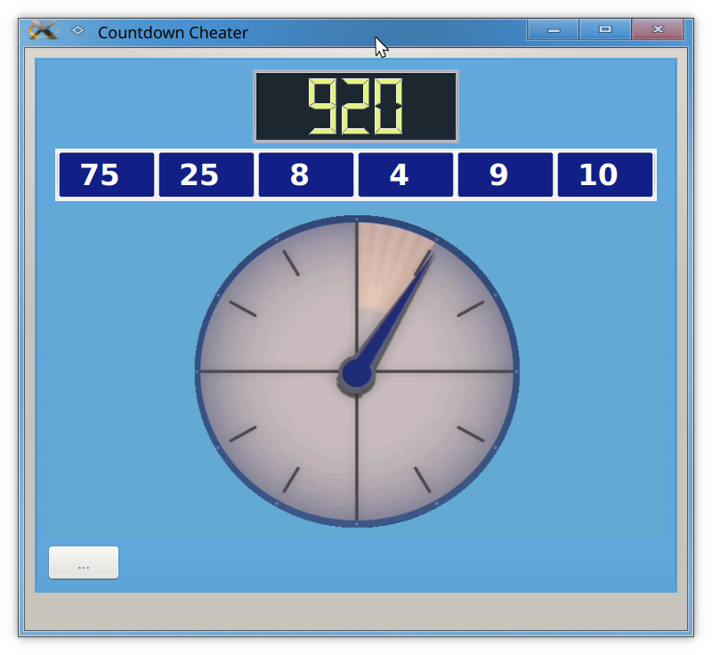
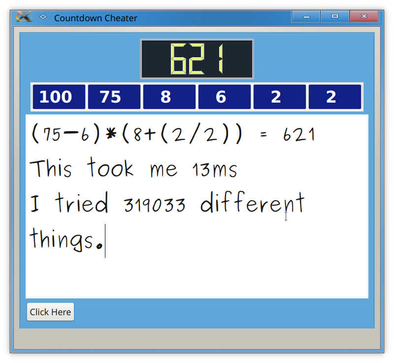

# Cheat at the arithmetic part of Countdown

Finishing off the GUI stuff took me longer than expected so I'm quickly writing some stuff so people know what this application does.



Countdown is a UK game show where contestants have 30 seconds to complete one of two tasks. The first task is to produce the longest word from nine random letters. The second task is to use simple arithmetic with six random numbers to produce some other desired random number. Contestants have 30 seconds to do these tasks. I've never watched the show but I have watched a more amusing show that is some sort of spinoff of it called [8_Out_of_10_Cats_Does_Countdown]. Here I'm just going to go into detail about math section of the game show.

If the contestants can't figure out how to solve the arithmetic problem an attractive lady called Rachel Riley shows draws on the board how it can be done. She does this there on the spot without using any electronic aids. For someone like me who's not particularly good at arithmetic it's quite an impressive feat to see someone do this. This got me wondering if I could phrase this problem as an algorithm; a systematic way to solve this problem that could be easily programmed into the computer.

Here's an example of the problem and something I would imagine Rachel could figure out how to do seemingly instantaneously on her head. Here are six random numbers, `16,60,11,12,18,15,` somehow add divide and multiply these numbers together to get another random number say `586`. One such solution is `586=(((16*60)*11)-12)/18`. How long did it take you to do that?

I was looking to create an algorithm that would reduce a problem of to numbers into one number. For example if you were given numbers eight and six how many ways are there to reduce this down to one number using just the rules of Countdown? You could multiply them, add them, subtract the smaller from the larger, divide the larger by the smaller, discard the eight, will discard the six. If they were both the same then the order of the division and subtraction makes no difference, and the subtraction is pointless. So, say that makes six operations that can be done to turn a vector of two numbers into one number within the rules of Countdown. Countdown doesn't allow negative intermediate numbers or fractional numbers. To reduce three numbers down to two numbers you can select any two numbers from those three numbers, there are three ways of doing that and we have already seen that there are six ways of dealing with each of these two them so that produces `3*6=18` different things you can do to go from three numbers to one number. Continuing this line of thought the number of things you have to try for `n` different numbers is...

```
things to try=(((number of operations)/2)^(n-1))*(((n!)^2)/n)
```

For Countdown 'n=6' and `number of operations=6` and the number of things to try are `things to try=20,995,200`. Clearly this is a big number and explains why I have never seen an episode where Rachel can't solve the problem. The random desired number can only hide between 1 and 999, there is simply very little space in which the random desired number can hide. Obviously there's going to be a lot of repeated numbers but for 21 million numbers but still it seems unlikely that the wanted random number is not going to be in one of these 21 million numbers especially considering the other random numbers are all around the 1 to 100 range.  Anyway I digress. Computer power wise 21 million numbers is a tiny thing to compute so I wrote the following code that reduces a vector of size `n` to `n-1`...

```C++
void Number_Cheater::vector_work(const QVector<double> &vec)
{
    QVector<double> new_vec;
    new_vec.resize(vec.size()-1);
    for(int a=0;a<vec.size();a++)
    {
        for(int b=a+1;b<vec.size();b++)
        {
            //qDebug()<<a<<b; using these two numbers

            //create a vector without these two numbers and leave the last entry spare
            int new_vec_pos=0;
            for(int j=0;j<vec.size();j++)
            {
                if((j==a)||(j==b))continue;
                new_vec[new_vec_pos]=vec[j];
                new_vec_pos++;
            }

            //run through all ops with a and b for the last space of the new vector
            for(int i=-2;i<6;i++)//dropping allowed
            //for(int i=0;i<6;i++)//must used every number
            {
                switch (i)
                {
                case 0://+
                    new_vec[new_vec_pos]=vec[a]+vec[b];
                    break;
                case 1://*
                    new_vec[new_vec_pos]=vec[a]*vec[b];
                    break;
                case 2://-
                    new_vec[new_vec_pos]=vec[a]-vec[b];
                    if(new_vec[new_vec_pos]<0.0)continue;//pass on negative intermediate numbers
                    break;
                case 3://-
                    new_vec[new_vec_pos]=vec[b]-vec[a];
                    if(new_vec[new_vec_pos]<0.0)continue;//pass on negative intermediate numbers
                    break;
                case 4:// /
                    new_vec[new_vec_pos]=vec[a]/vec[b];
                    if((!use_fractions)&&((new_vec[new_vec_pos]-floor(new_vec[new_vec_pos]))!=0))continue;//pass on fractions
                    break;
                case 5:// /
                    new_vec[new_vec_pos]=vec[b]/vec[a];
                    if((!use_fractions)&&((new_vec[new_vec_pos]-floor(new_vec[new_vec_pos]))!=0))continue;//pass on fractions
                    break;
                case -2:// drop b
                    new_vec[new_vec_pos]=vec[a];
                    break;
                case -1:// drop a
                    new_vec[new_vec_pos]=vec[b];
                    break;
                default:
                    assert(1==0);
                    break;
                }

                if(new_vec.size()>1)
                {
                    vector_work(new_vec);
                }
                 else
                 {
                    //qDebug()<<"sol="<<new_vec[0];
                    counter++;
                    if(val_wanted==new_vec[0])
                    {
                        val_is_correct=true;
                        qDebug()<<"calulated ="<<new_vec[0];
                        qDebug()<<"got val";
                    }
                 }
                if(val_is_correct)
                {
                    if(i>=0)//ignore dropped numbers
                    {
                        QVector<double> equation_single={vec[a],(double)i,vec[b]};
                        equations.push_front(equation_single);
                    }
                    return;
                }

            }

        }
    }
}
```

I like this function as it recursively calls itself so it doesn't just stop at `n-1`, it continues all the way down to a vector of length one. It's the kind of function that university teachers love to get their students to look at and I must admit there is some beauty in these kinds of functions.

So anyway, once this recursive function finds the number you're looking for it pushes all the equations that it used to get the solution as it uncoils itself from the recursive function. After that's done you just have to group the equations in brackets and you're done.

While there may be about 21 million things to try you can see from the following screenshot that usually just a few million at most are needed to find the solution.



One interesting thing you might have noticed from previous code is it's possible to force the algorithm to use every single number exactly once. This is interesting because of its elegance and also there are fewer things to try as we no longer need to drop numbers; using the same formula as before we get...

```
things to try if we use every number exactly once=2,764,800
```

So there are still a surprisingly large number of them and from the tests I've done it's actually possible quite a lot of the time. It's also a lot quicker to calculate all the possibilities as there are fewer often.

Another pointless interesting thing I noticed was that `(((n!)^2)/n)` for `n=6` is the number of seconds in a day :)

Anyway here you go, the perfect ways to cheat at the arithmetic part of countdown. Hopefully at the very least it will give people a chuckle as the clock counts down.

##  Compiling

It's written with C++ and QT. I didn't spend much time figuring out the bugs but with the clock animation I had to change bits and pieces when running on Linux compared to when running on Windows. The current source file in the repository are the settings that gave the fewest bugs on Linux. If I find some time I'll merge the two versions to this repo.

Jonti 2019

[8_Out_of_10_Cats_Does_Countdown]: https://en.wikipedia.org/wiki/8_Out_of_10_Cats_Does_Countdown
